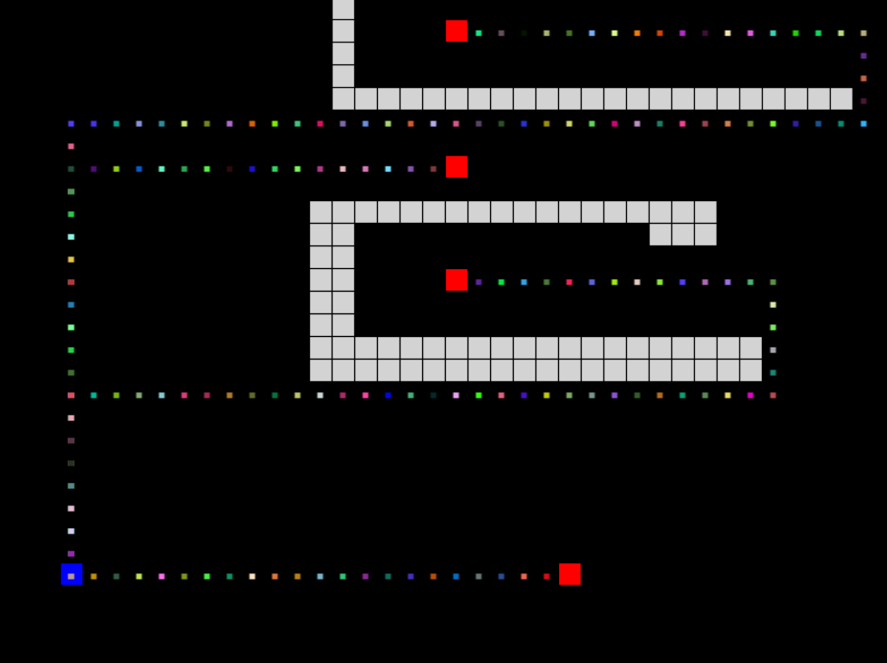

# Path Finding Test

Simple usage of [BFS Algorithm](https://en.wikipedia.org/wiki/Breadth-first_search) to find the shortest path in a 2-dimensional grid. 

In this example, you can also draw obstacles or move on the grid to hinder the enemies and observe how they recalculate the shortest path to reach you.

